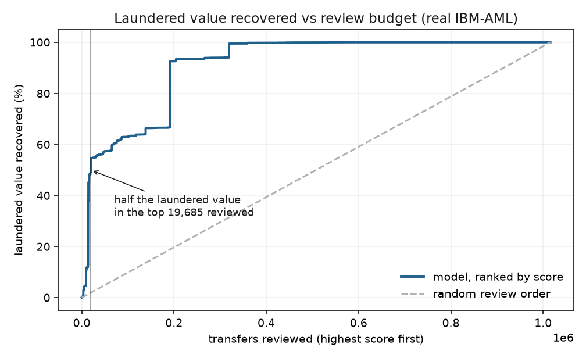
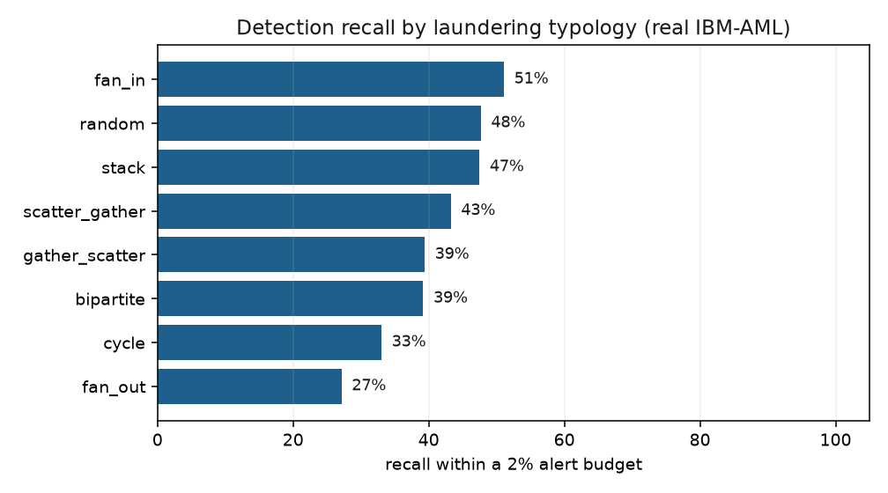

# Money-Mule Network Detection

Detecting money laundering from the shape of money flow, not one transaction at a time.

Laundering is a tiny fraction of all transfers, well under one percent, so scoring
transactions in isolation captures almost none of it. The signal lives in structure:
many
accounts feeding one (fan-in), one feeding many (fan-out), money walked along a chain,
cycles, and rapid pass-through where funds arrive and leave almost at once. This project
builds the account graph, computes features over it, scores transfers, and ranks
accounts for investigation. It runs on the IBM "Transactions for Anti-Money Laundering"
dataset, and on a schema-faithful mock with no download.

## Two kinds of feature, kept separate on purpose

This separation is the core discipline of the project.

**Streaming features** (`graph_features.prior_features`) describe an account's history
*strictly before* the current transfer: distinct counterparties and amounts so far, its
pass-through ratio, whether the current amount is a spike against the account's usual
inflow, and the burst counts (counterparties arriving in a short trailing window) that
tell a mule hub apart from a legit account of the same total degree. They use no future
information, so they are what a real-time monitor could score on. A feature computed on
an account's later transfers is the graph version of lookahead: information you would not
have at decision time.

The guard is tested directly, not asserted in a comment. Features computed on a
time-prefix of the data must equal the features computed on the full data for those same
early rows; if a later transfer changes an earlier row, that is leakage
(`tests/test_graph_features.py`).

**Retrospective features** (`graph_features.account_summary`) describe an account over a
whole window for an investigator: peak burst, a u-turn measure, and burst concentration.
They are not leakage-safe for real-time scoring and are never model inputs; they support
the investigation view.

## Surfacing candidate networks

A real transaction graph is one giant weakly connected component, so components of the
raw graph tell you nothing. `candidate_networks` flags accounts by typology-specific
structure and takes the weakly connected components of the transfers among them, then
pulls in the ego network of each flagged hub. That last step matters for star
typologies: a fan-in ring is one collector plus many one-shot senders that have no
signature on their own, and the only way to recover them is to expand outward from the
hub you can detect.

## Scoring and the investigation queue

A gradient-boosted model scores each transfer from the leakage-safe streaming features,
trained on a time split so it never sees the future. Because those features carry each
account's network context, this is network-aware transaction scoring rather than
isolated-row scoring, which is the whole point at a base rate this low. Scores aggregate
to account risk, and `account_queue` ranks accounts with plain-language reason codes, so
an alert explains itself ("fans out: 14 outflows in a short window").

Evaluation reports what a review team can act on: transaction PR-AUC, precision and
recall and value recovered under a fixed alert budget, and recall broken out per
typology, since the model is strong on some and weak on others.

## Results on real data (HI-Small)

Roughly 5.08 million transfers at a 0.177% laundering rate on the held-out tail. The full
write-up is in [docs/aml_design.md](docs/aml_design.md); the short version follows.

Per-transaction PR-AUC is 0.037, about twenty times the base rate but low in
absolute terms, which is the reality of per-transaction laundering detection. The
operating result is the useful one: reviewing the top 2% of scored transfers recovers
**54.5% of laundered value** and 38% of laundering transfers.



Recall per typology within that budget lands between 27% and 51% across all eight IBM
typologies (fan-in 51%, stack 47%, scatter-gather 43%, cycle 33%, fan-out 27%, and the
rest between): nothing cleanly solved, nothing missed.



The account queue exposed the real difficulty. Ranking by expected laundered value
surfaces legitimate payment processors and exchanges that move enormous volume through
thousands of counterparties. The separating idea is burst concentration, the share of an
account's activity that falls in its single busiest window: a mule's activity is
concentrated, a legit hub's is spread across the year. Weighting the queue by risk,
log-dollars, and concentration lifted the laundering share at the top from two in ten to
six in ten. Telling mules apart from legitimate high-throughput accounts is the central
open problem here, and concentration is a first step, not a solution.

## What this does not solve

The dataset is synthetic, because no bank releases labelled mule data; this is the
standard public stand-in and the ceiling on any claim made from it. On the mock the model
reaches a PR-AUC near 0.99, which is a property of clean injected typologies and the
absence of legitimate high-throughput accounts, not a result. A production system would
add peer-group baselines (throughput relative to accounts of the same type) and
account-history features (how new the behaviour is), and would score entities and
networks rather than isolated transfers.

## Quickstart

```bash
python -m venv .venv && source .venv/bin/activate
pip install -e ".[dev]"
make test            # includes the no-lookahead guard
python run_demo.py   # graph, features, and network surfacing
python run_model.py  # train, evaluate, and print the account queue
python scripts/run_investigation.py  # analyst SQL over the transactions (DuckDB)
python scripts/make_figures.py       # value-vs-budget and per-typology recall
```

Download instructions are in [`data/aml/README.md`](data/aml/README.md). Raw data is
git-ignored, and with none present everything runs on the mock.
